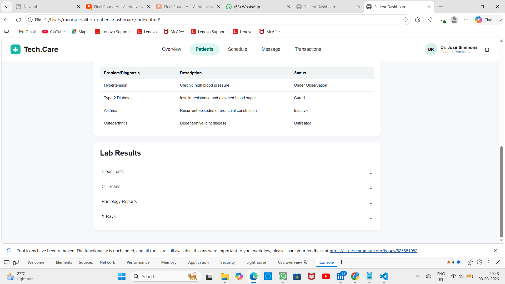

# 🏥 Coalition Patient Dashboard

A responsive **Patient Healthcare Dashboard** developed as part of a frontend technical assessment. The project converts the provided design into a functional web interface and uses **API integration to dynamically populate patient information**.

## ⭐ Project Highlights

* 🎨 **Design to HTML Conversion** — Recreated the provided dashboard design with attention to layout, spacing, typography, and visual structure.
* 🔄 **API Integration** — Dynamically retrieves and displays patient data through API calls.
* 👤 **Patient Profile** — Displays patient information in a clear and structured dashboard.
* 📊 **Health Metrics** — Presents patient health information and diagnostic data in an easy-to-read format.
* 📱 **Responsive UI** — Designed to provide a consistent experience across different screen sizes.
* ⚡ **Interactive Interface** — Dashboard sections are dynamically populated and organized for usability.
* 🧹 **Clean Frontend Structure** — Structured HTML, CSS, and JavaScript for maintainability.

## 🛠️ Technologies

**HTML5 • CSS3 • JavaScript • REST API • JSON • Responsive Web Design**

## 📸 Dashboard Preview

## 🎯 Assessment Objective

The goal of this project was to transform the provided design reference into a functional, responsive web application while integrating API data to populate the dashboard dynamically.

## ▶️ How to Run

1. Clone or download the repository.
2. Open the project folder.
3. Run the project using a local development server.
4. Open the application in your browser.

## 👨‍💻 Developer

**Manoj Kumar Edla**
Java Full Stack Developer

---

⭐ **Built as part of a frontend technical assessment demonstrating UI implementation, responsive design, and API integration.**
